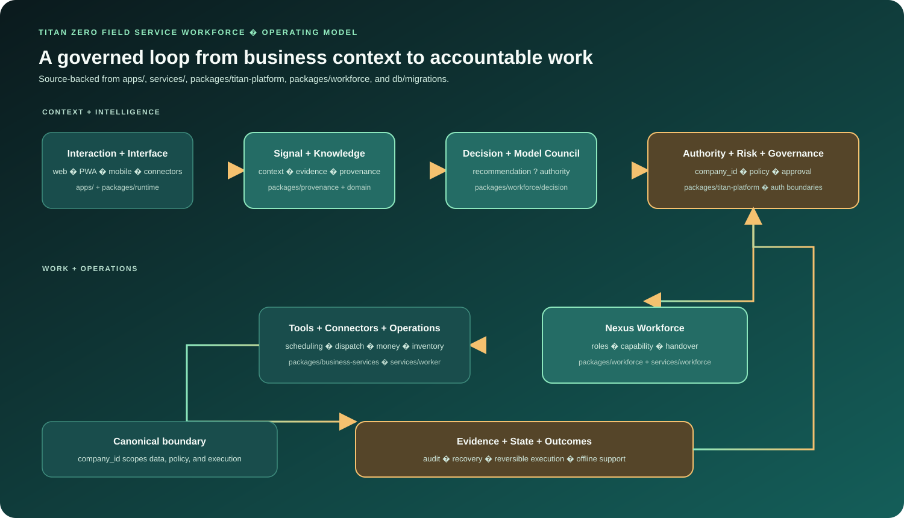

<p align="center">
  
</p>

# Titan Zero Field Service Workforce

**Governed AI workforce for field-service operations**

## Overview

Titan Zero Field Service Workforce is a TypeScript operating platform for companies that coordinate office teams, field workers, customers, and connected systems. It combines scheduling, dispatch, work execution, customer care, authority controls, and evidence into one company-scoped workflow.

The platform is designed for operations teams that need intelligent assistance to move work forward while keeping every consequential action attributable, reviewable, and reversible.


## Measured evidence

This repository currently has **focused verification**, not a single benchmark that proves end-to-end production readiness.

| Evidence | Current status | Reproduce / inspect |
| --- | --- | --- |
| Native workforce contract lane | **Runnable from a clean checkout** | `pnpm --filter @titan-zero/titan-platform test:workforce-native` |
| Six native agent maps | **Implemented** | `packages/titan-platform/src/workforce-native/contracts.ts` |
| Runtime authority revalidation | **Implemented in source** | `packages/runtime/authority/runtime-authority-gateway.mjs` |
| Broader route/session/communications checks | **Recorded as scoped local evidence** | repository docs and focused tests |
| Live DirectAdmin commissioning / provider delivery | **Environment-dependent** | not claimed by repository-only verification |
| Full production readiness | **Not claimed** | requires exact-head deployment evidence |

The focused workforce command compiles the native workforce source and exercises contract, agent-map, workflow, and parity checks without requiring provider credentials or live authority. The [Workforce Verification workflow](.github/workflows/workforce-verification.yml) is the canonical CI lane for this evidence.

## What is new

The technical signature is a **company-scoped AI workforce in which identity, recommendation, authority, execution, and evidence are separate states**.

| Mechanism | Engineering distinction | Primary implementation |
| --- | --- | --- |
| **Native role contracts** | Reception, Sales, Booking, Scheduling, Jobs, and Customer Care have explicit operations, handoff targets, and ownership instead of prompt-only personas. | `packages/titan-platform/src/workforce-native/contracts.ts` |
| **Company-scoped truth** | Native maps bind to `company_id` and explicitly reject identity as an authority grant. | workforce-native contracts |
| **Authority revalidation at execution** | Consequential execution rechecks company, capability, actor, and idempotency context immediately before the execution gateway. | `packages/runtime/authority/runtime-authority-gateway.mjs` |
| **Existing operational APIs as source of truth** | Workforce maps point to booking, estimate, property, job, visit, work-order, and user APIs instead of creating parallel business state. | platform/runtime adapters |
| **Recoverable hosted runtime** | Readiness, conversations, bounded adapters, storage checks, and recovery paths are explicit runtime concerns. | `services/workforce/src/server.ts` |

### Evidence status

- **Implemented:** native role maps, company-scoped contracts, hosted workforce runtime, operational adapters, and authority gateway.
- **Focused verification available:** native workforce compile/contract/workflow/parity lane.
- **Environment-dependent:** provider credentials, DirectAdmin forwarding, live delivery, upstream services, and deployment commissioning.
- **Not claimed:** blanket production readiness or a repository-wide security score.


<p align="center">
  
</p>

## Verified capabilities

- **Six native agent roles:** Reception, Sales, Booking, Scheduling, Jobs, and Customer Care are explicit maps in `packages/titan-platform/src/workforce-native/contracts.ts`, each with named operations, handoff targets, and canonical Business Ops ownership.
- **Company-scoped business truth:** Every native agent map declares `company_id` as its boundary and `identityGrantsAuthority: false`; identity can provide context, but it does not authorize an action by itself.
- **Operational execution:** The maps point to existing client, booking-request, estimate, property, job, visit, work-order, and user APIs instead of creating a parallel source of truth.
- **Hosted workforce runtime:** `services/workforce/src/server.ts` provides readiness probes, conversation handling, bounded adapters, DirectAdmin forwarding controls, recovery paths, and separate runtime/identity storage checks.

## Architecture that keeps intelligence governable

The central design choice is to keep understanding, decision, authority, execution, and evidence as separate states. A recommendation can be useful without becoming permission to act, and an approved action can be rechecked immediately before execution.

<p align="center">
  
</p>

The runtime authority gateway in `packages/runtime/authority/runtime-authority-gateway.mjs` re-evaluates current authority at the consequential execution boundary. It binds the operation to company, capability, actor, and idempotency context, records the refreshed decision, and only then calls the execution gateway.

## Engineering map

| Area | Responsibility |
| --- | --- |
| `apps/web/` | Next.js operational web surfaces and authenticated workflows. |
| `services/workforce/` | Hosted HTTP runtime, conversations, readiness, recovery, storage checks, and DirectAdmin composition. |
| `packages/titan-platform/` | Native agent maps, platform contracts, workforce evidence, and the focused verification lane. |
| `packages/runtime/` | Authority and execution boundaries, including revalidation and idempotency. |
| `packages/storage/`, `db/` | SQLite/native storage and migration history. |
| `packages/tools/` | Bounded execution adapters and gateway calls. |
| `ai/`, `docs/`, `tests/` | Canonical rules, contracts, evidence records, and focused test suites. |

## Evidence and verification

The focused native workforce evaluator is runnable without provider credentials or live authority:

```bash
pnpm --filter @titan-zero/titan-platform test:workforce-native
```

It compiles the native Workforce source and exercises the selected contract, six-agent, workflow, and parity checks. The [Workforce Verification workflow](.github/workflows/workforce-verification.yml) defines and publishes this focused lane; run it at the exact head before treating current verification as evidence.

The repository also retains broader local evidence for route/session, DirectAdmin owner, and communications checks. Those results are scoped observations, not a combined security score, coverage claim, or production certification.

## Quickstart

For a clean checkout, Node.js `>=20.9.0` and pnpm `9.12.0` are required:

```bash
cp .env.example .env
pnpm install
pnpm db:migrate
pnpm dev:web
```

The default local path is SQLite. `pnpm db:migrate:server` is a separate compatibility path for shared PostgreSQL and requires `MIGRATION_DATABASE_URL` or `DATABASE_URL`. On Windows, run Bash-based gates and migrations from Git Bash or WSL.

## Portfolio scope

Titan Zero Field Service Workforce is active development rather than a blanket production-readiness claim. Live DirectAdmin commissioning, upstream credentials, provider delivery, deployment evidence, and the full repository gate remain environment-dependent.

The `archive/` tree and release candidates are retained for provenance and integration review. The relationship between this canonical field-service product and the separate TitanPro/Titan-Zero repositories should be described through their actual boundaries, not assumed from shared naming.

For the detailed code map and evidence boundaries, see [docs/PORTFOLIO.md](docs/PORTFOLIO.md).